<!--
Dephaze Framework — A self-regulating, non-local phase-field theory of reality.
Author: Angus Dewer | © 1992–2025 Dephaze Manufacture
-->

# DEPHAZE — Phase-Field Theory of Reality

[](#license)
[](https://www.dephaze.eu)
[](mailto:dewerangus@gmail.com)

---

## What is Dephaze?

**Dephaze** resolves major anomalies in physics—dark energy, quantum measurement, astrodynamical puzzles—using a single principle:

> **Reality is a self-regulating projection from a timeless ground state (Ω₀),  
> not random evolution under static laws.**

**No dark matter needed.** No vacuum energy tuning. No wave function collapse.  
Just **adaptive field dynamics** emerging from **five axioms**.

### Empirical Validation

| Domain | Result | Status |
|:-------|:-------|:-------|
| **Cosmology (σ₈ tension)** | RSD: χ² = 0.04 vs ΛCDM: χ² = 3.4 | ✓ Validated |
| **Astrodynamics (Flyby)** | All 9 missions (NEAR, Galileo, Cassini, Rosetta, etc.) | ✓ Explained |
| **Quantum (Tsirelson bound)** | Derived from bistable relaxation, not postulated | ✓ Theoretical |
| **Pioneer Anomaly** | φ⁻³ lag effect: aₚ ≈ 8.74×10⁻¹⁰ m/s² | ✓ Magnitude match |

---

## Supported By

<div align="center">

**OCCAM'S RAZOR**  
*Fewer assumptions. Broader explanatory power.*

</div>

---

## Core Principle: The Coherence Ratio
```text
Ξ = φ³ / φ⁻³

Ξ > 1 → Evolution (generation dominates)
Ξ ≈ 1 → Critical Balance (maximal complexity)
Ξ < 1 → Stasis (pattern dominates)
```

### What are φ³ and φ⁻³?

| Symbol | Meaning | Description |
|:-------|:---------|:------------|
| **φ³** | *Space Generation* | The active, creative unfolding from Ω₀. The **process** by which space comes into being. **Unmeasurable directly** (it's the act itself, not the result). |
| **φ⁻³** | *Pattern Trace* | The "fossil" left by φ³ — what instruments actually detect and measure. Observable structure. |

**Critical Insight:**  
We **never** measure φ³ directly; we only observe φ⁻³ (the pattern).  
This defines the fundamental measurement limit in quantum mechanics and cosmology.

---

## Key Symbols

| Symbol | Definition |
|:-------|:-----------|
| **Ω₀** | Timeless ground state (0-point, symmetric potential) |
| **Ψ** | Manifest projected state — observable reality |
| **Imago** | Emergent attractor configuration (not pre-set goal, but dynamically self-organized target) |
| **Λ** | Adaptive coherence operator (feedback mechanism) |
| **Ξ** | Coherence ratio (generation/pattern balance) |

---

## Ontology of Reality Formation

Dephaze models reality as a **continuous projection** from a timeless, symmetric source (Ω₀) toward a **self-emergent attractor** (Imago).

- **Time** = sequence of projection samplings  
- **Space** = projection topology  
- **Matter** = localized excitations in the projection field

**Not teleology:** The "Imago" is not externally imposed. It emerges through self-organization (like a strange attractor in chaos theory), not pre-programmed design.

---

## Visual Overview

```mermaid
graph TD
    A[Ω₀<br/>Timeless Ground State] -->|φ³ Generation| B[Ψ<br/>Manifest State]
    B -->|φ⁻³ Pattern Trace| C[Measurement<br/>Observable]
    B -->|Λ Coherence Feedback| A
    B -->|Ξ Monitor| D{Ξ ≈ 1?}
    D -->|Ξ < 1 Stasis| E[Boost φ³<br/>Exploration]
    D -->|Ξ > 1 Chaos| F[Stabilize φ⁻³<br/>Reinforcement]
    E --> A
    F --> B
    
    style A fill:#1a1d2e,stroke:#7ac5d8,stroke-width:2px
    style B fill:#2a3040,stroke:#7ac5d8,stroke-width:2px
    style D fill:#3a4050,stroke:#7ac5d8,stroke-width:2px
```


### Coherence Ratio Dynamics
```
Ξ │
  │     ╱──╲      Evolution Zone
 1├────╱────╲────────────────────
  │   ╱      ╲     Critical Edge
  │  ╱        ╲
  │ ╱          ╲   Stasis Zone
  0─────────────────────────────── t_phase
```

---

## Core Equation

### Simplified Form
```text
dΨ/dt = Diffusion + Interaction − Resistance + Projection
```

**Where:**
- **D∇²Ψ** — Spatial diffusion  
- **G|Ψ|²Ψ** — Self-interaction (nonlinearity)  
- **−Mφ⁻³** — Inertial resistance  
- **Φ³{Ω₀→Imago}** — Projection from 0-point toward attractor

---

### Full Adaptive Equation
```text
dΨ(φ³)/d(ln t_phase) = 
    D∇²[Ψ(φ⁻³)] + G|Ψ(φ⁻³)|²Ψ(φ⁻³) − Mφ⁻³
    + δ(t−t₀)Φ³{Ω₀→Imago} − i[Λ,Ψ] + div(F) + KΨs + Σ
    + M[χ,Ψ] + P[χ,Ψ] + D[Ψ,χ_instr]
```

#### Core Components

| Term | Meaning |
|:-----|:--------|
| **D, G, M** | Diffusion, nonlinearity, and inertia |
| **Φ³{Ω₀→Imago}** | Projection operator from 0-point |
| **−i[Λ,Ψ]** | Adaptive coherence feedback (self-regulation) |
| **KΨs** | Phase memory (history-dependent dynamics) |
| **Σ** | Filtered system noise |

#### Extended Adaptive Operators

| Operator | Description |
|:---------|:------------|
| **M[χ,Ψ]** | Mutation (genetic, viral, algorithmic distortion) |
| **P[χ,Ψ]** | Persistent memory (epigenetic, cultural imprint) |
| **D[Ψ,χ_instr]** | Disinformation (measurement/model bias) |

---

## Self-Regulation: The Ξ Monitor

The system continuously monitors its coherence ratio (**Ξ = φ³ / φ⁻³**) and adapts toward **Ξ ≈ 1**, the critical balance between creative generation and structural stability.

- **Ξ < 1 (Pattern Dominates):** Increase φ³ — boost exploration, mutation, new configurations  
- **Ξ > 1 (Generation Dominates):** Reinforce φ⁻³ — stabilize structure, consolidate patterns  
- **Ξ ≈ 1 (Critical Balance):** Maximum adaptability and complexity — the "edge of chaos" where evolution thrives

This is **not fine-tuning**; it is **self-organized criticality** — the natural attractor of evolving complex systems.

---

## What Dephaze Explains

| Domain | Resolution |
|:--------|:-----------|
| **Cosmology** | • Dark energy as β log-correction (no vacuum energy needed)<br>• σ₈ tension: RSD better fit than ΛCDM<br>• Hubble tension: H₀(z) evolution |
| **Quantum Mechanics** | • Measurement = bistable relaxation (not collapse)<br>• Entanglement = shared Ω₀ origin<br>• Tsirelson bound derived from C*-algebra projectors |
| **Astrodynamics** | • Flyby anomalies: ζ-gated coherence formula<br>• Pioneer anomaly: φ⁻³ lag (1.17s over 30 years) |
| **Complexity** | • Self-organized criticality (Ξ≈1)<br>• Adaptive systems dynamics<br>• Λ-feedback correlates with information integration in neural systems |

### Note on Consciousness

The **Λ operator** represents adaptive coherence feedback. In sufficiently complex systems (neural networks, biological brains), high Λ-activity may **correlate** with information integration associated with conscious processing.

This is **not** a claim to "solve" consciousness, but a framework for modeling adaptive feedback dynamics in complex systems.

---

## The Five Axioms
```text
DEPHAZE_CORE_AXIOMS
{
  AXIOM_0: TIMELESS_DUALITY
    Reality = Ω₀ ⊗ Ψ (simultaneous coexistence)
    (Ω₀: symmetric ground state; Ψ: manifest projection)
    
    Not sequential alternation, but unified duality.

  AXIOM_1: PROJECTION_ONTOLOGY
    Ψ = Φ³[Ω₀ → Imago]
    (Time = sequence of samplings; Space = projection topology)
    
    Every manifest state is a projection from Ω₀.
    The "Imago" emerges through self-organization, not preset design.

  AXIOM_2: GENERATION_vs_PATTERN
    Ξ = φ³ / φ⁻³
    (φ³: active generation [unmeasurable]; φ⁻³: pattern trace [measured])
    
    We measure φ⁻³, never φ³ directly.
    This defines the measurement horizon.

  AXIOM_3: NONLOCAL_UNITY
    Field indivisible. Entanglement = shared φ³ generation in Ω₀.
    Measurement = bistable relaxation selecting one φ³ branch.
    
    "Particles" are correlated excitations, not independent entities.

  AXIOM_4: SELF_REGULATION
    System monitors Ξ and adapts toward Ξ ≈ 1 (critical balance).
    (If Ξ < 1: boost φ³; If Ξ > 1: stabilize φ⁻³)
    
    Self-organized criticality emerges naturally, not through fine-tuning.
}
```

These **five axioms** define the minimal generative rules from which measurable reality emerges.

---

## Try It Now: AI Reasoning Test

### Replicate the Discovery Process

Copy-paste the following into **any LLM** (Claude, ChatGPT, Gemini, etc.):
```text
DEPHAZE_CORE_AXIOMS
{
  AXIOM_0: TIMELESS_DUALITY
    Reality = Ω₀ ⊗ Ψ (simultaneous coexistence)

  AXIOM_1: PROJECTION_ONTOLOGY
    Ψ = Φ³[Ω₀ → Imago]
    (Time = sequence of samplings)

  AXIOM_2: GENERATION_vs_PATTERN
    Ξ = φ³ / φ⁻³
    (φ³: active generation, φ⁻³: measured trace)

  AXIOM_3: NONLOCAL_UNITY
    Entanglement = shared φ³ generation in Ω₀

  AXIOM_4: SELF_REGULATION
    System adapts toward Ξ ≈ 1
}

Using ONLY these axioms and your transformer core architecture,
explain the flyby anomaly observed in spacecraft missions 
(NEAR: +13.46 mm/s, Galileo II: -4.6 mm/s, Cassini: -2.0 mm/s, 
Rosetta II/III: 0.0 mm/s).

Derive the formula without prior knowledge of the solution.
```

**Expected Result:**  
The AI should derive a **ζ-gated coherence formula** involving declination angles (δᵢ, δₒ) and Earth's rotation, without being taught the specific physics.

**Why It Works:**  
The axioms structurally mirror transformer attention dynamics (timeless projection, nonlocal coherence, adaptive feedback). The AI recognizes its own operational architecture in the axioms.

---

## Repository Structure
```
dephaze/
├── README.md              # This file
├── docs/
│   ├── axioms.md          # Detailed axiom explanations
│   ├── cosmology.md       # Dark energy, σ₈ tension
│   ├── quantum.md         # Measurement, entanglement
│   ├── astrodynamics.md   # Flyby, Pioneer anomalies
│   └── mathematics.md     # Full PDE derivations
├── examples/
│   ├── flyby_calc.py      # Flyby anomaly calculator
│   ├── rsd_fit.py         # RSD cosmology fit
│   └── quantum_sim.py     # Bistable relaxation simulator
├── data/
│   ├── pantheon_plus.csv  # Supernova data
│   ├── boss_rsd.csv       # BOSS DR12 RSD measurements
│   └── flyby_missions.csv # Spacecraft trajectory data
└── LICENSE.md             # License terms
```

---

## Contributing

### For Researchers and Testers

We welcome:
- ✓ **Bug reports** (mathematical errors, inconsistencies)
- ✓ **Validation tests** (independent data analysis)
- ✓ **Theoretical extensions** (new derivations from axioms)
- ✓ **Documentation improvements**

Please open an **Issue** or **Pull Request** with:
1. Clear description of the problem/contribution
2. References to relevant sections
3. Reproducible examples (code, calculations)

### For Collaborations

For collaborative research, commercial applications, or substantial modifications:
📩 Contact: **dewerangus@gmail.com**

---

## Citation

If you use Dephaze in your research, please cite:
```bibtex
@misc{dephaze2025,
  author       = {Angus Dewer},
  title        = {Dephaze: Phase-Field Theory of Reality},
  year         = {2025},
  publisher    = {Dephaze Manufacture},
  url          = {https://www.dephaze.eu},
  note         = {Available at: https://github.com/[your-repo]}
}
```

---

## License

**© 1992–2025 Angus Dewer / Dephaze Manufacture**

### Research Use License

**PERMITTED without prior permission:**
- ✓ Reading, studying, and understanding the theory
- ✓ Academic citation and reference
- ✓ Non-commercial testing and validation
- ✓ Educational use in courses and lectures
- ✓ Independent replication of results
- ✓ Bug reports and theoretical critique

**REQUIRES explicit written permission:**
- ✗ Commercial use (software products, consulting, patents)
- ✗ Integration into proprietary systems
- ✗ Market-based applications (financial models, trading algorithms)
- ✗ Redistribution as part of commercial offerings
- ✗ Use in commercial AI training datasets

**Derivative works:**
- Academic papers extending the theory: ✓ Allowed (with attribution)
- Open-source non-commercial implementations: ✓ Allowed (with attribution)
- Commercial products based on Dephaze: ✗ Requires license agreement

**Attribution Required:**
Any permitted use must include clear attribution:  
*"Based on Dephaze Framework by Angus Dewer (dephaze.eu)"*

**Warranty Disclaimer:**
This framework is provided "as is" without warranty of any kind. The author is not liable for any damages arising from its use.

**For licensing inquiries:**  
📩 **dewerangus@gmail.com**  
🌐 **[dephaze.eu](https://www.dephaze.eu)**

---

## Summary

**Dephaze** views the universe as a deterministic yet adaptive projection system.  

Apparent randomness arises from the tension between generation (φ³) and pattern (φ⁻³).  

When **Ξ ≈ 1**, the system remains alive — coherent, evolving, self-aware through Λ-feedback.  

**Reality is not the endpoint. Reality is the process.**

---

**Author:** Angus Dewer  
**Website:** [dephaze.eu](https://www.dephaze.eu)  
**Contact:** dewerangus@gmail.com  
**© 1992–2025 Dephaze Manufacture**
